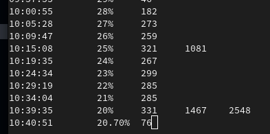

# Linux_battery_status
## Program do monitorowania poziomu baterii w systemie Linux. Aplikacja pokazuje aktualny poziom baterii z dokładnością do dwóch miejsc po przecinku oraz czas w sekundach, który minął od ostatniej zmiany części całkowitej poziomu baterii. Dodatkowo, jeżeli nowa wartość baterii jest podzielna przez 5 lub przez 10 to wypisana będzie ilość sekund, które upłynęły od wystąpienia ostatni raz takiej sytuacji.

# Screenshots

